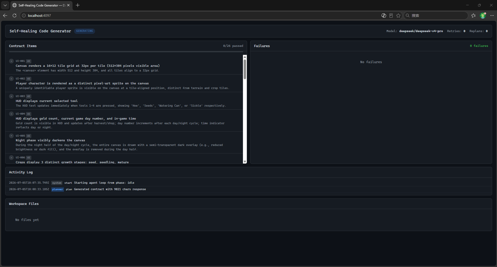

# Self-healing Code Generator

基于 [opencode SDK](https://opencode.ai) 的自我调试修复自动 Agent 系统。三角色协作（Planner / Generator / Evaluator），根据需求文档自主实现功能，遇到错误自动修复，直到达成目标或明确报告卡点。

## 架构设计

遵循 [doc/LOOP_PRINCIPLES.md](doc/LOOP_PRINCIPLES.md) 的循环哲学：

```
┌─────────────────────────────────────────────────┐
│  LOAD checkpoint → 确定从哪个阶段恢复              │
│                                                   │
│  ┌──────────┐   ┌───────────┐   ┌────────────┐  │
│  │ PLANNER  │──▶│ GENERATOR │──▶│ EVALUATOR  │  │
│  │ 分析需求  │   │ 写代码    │   │ 验证+评分   │  │
│  │ 产契约    │   │           │   │            │  │
│  └──────────┘   └───────────┘   └────────────┘  │
│       ▲               ▲               │         │
│       │               │         通过？  │         │
│       │  重新规划      │      ┌────┴────┐       │
│       ├───────────────┘      │YES │NO  │       │
│       │                      │    │    │       │
│       │                      ▼    ▼    │       │
│  ┌────┴────┐            成功报告  ┌───────────┐ │
│  │ 卡住？  │                      │ 修复循环   │ │
│  │ YES→USER│                      │ 错误回灌   │ │
│  │ NO→重试  │                      │  Generator │ │
│  └─────────┘                      └───────────┘ │
└─────────────────────────────────────────────────┘
```

### 三角色分离

| 角色 | System Prompt | 职责 | 约束 |
|------|--------------|------|------|
| **Planner** | 技术架构师 | 将模糊需求分解为可验证的契约条款 | 不动代码，只产出 contract |
| **Generator** | 代码执行者 | 按契约束编写实现 | **禁止评价自己的代码** |
| **Evaluator** | 验尸官 | 运行测试、检查边界条件 | 默认代码有 bug，证明它 |

三个角色使用三个独立的 opencode session，通过文件系统通信（`state/contract.md`、`state/evaluation.json`），不依赖上下文窗口记忆。

### 自愈合机制

1. Evaluator 返回失败 → 记录具体错误
2. 错误格式化后发给 Generator 修复（同一 session 续接）
3. 重新进入 Evaluator 验证
4. 同一错误重复 ≥maxRetries 次 → 触发 Planner 重新规划
5. 重新规划后仍失败 ≥maxReplans 次 → 判定卡住，生成用户报告

### 状态持久化

崩溃后重启可从断点继续运行。

| 文件 | 用途 |
|------|------|
| `state/checkpoint.json` | 当前阶段、session ID、重试计数 |
| `state/contract.json` | 契约的 JSON 格式 |
| `state/contract.md` | 可验证的契约检查清单 (Markdown) |
| `state/progress.md` | 当前进度摘要 |
| `state/log.md` | 追加式操作日志（`## [TIMESTAMP] ROLE \| action`） |
| `state/evaluation.json` | 最新评估结果 |
| `state/debug/` | JSON 解析失败的原始响应 |

## 快速开始

### 前置条件

- Node.js >= 20
- [opencode CLI](https://opencode.ai) 已安装
- DeepSeek API Key（或其他 opencode 支持的提供商）

### 安装

```bash
git clone <repo>
cd Selfhealing_Agent_System
npm install
npm run build
```

### 配置

将 DeepSeek API Key 写入 `doc/DEEPSEEK_KEY.md`：

```
sk-your-api-key-here
```

或通过环境变量：

```bash
export DEEPSEEK_API_KEY=sk-your-api-key-here
```

或通过命令行参数：

```bash
npx tsx src/main.ts --api-key sk-your-api-key-here
```

### 使用

将需求写入 `requirements/current.md`，然后运行：

```bash
npm start          # 使用编译后的 JS (需先 build)
npm run dev        # 编译并直接运行
npx tsx src/main.ts  # 直接用 tsx 运行 TypeScript
```

或指定需求文件和参数：

```bash
npx tsx src/main.ts --requirements ./my-project.md --model deepseek/deepseek-v4-pro
```

### 命令行参数

| 参数 | 默认值 | 说明 |
|------|--------|------|
| `--requirements` | `requirements/current.md` | 需求文件路径 |
| `--workspace` | `workspace/` | 工作区目录（存放生成的代码） |
| `--state-dir` | `state/` | 状态持久化目录 |
| `--output-dir` | `output/` | 报告输出目录 |
| `--model` | `deepseek/deepseek-v4-pro` | 使用的模型 (`provider/model`) |
| `--api-key` | 从 `doc/DEEPSEEK_KEY.md` 读取 | API Key |
| `--key-file` | `doc/DEEPSEEK_KEY.md` | API Key 文件路径 |
| `--base-url` | 无 | 自定义 API 地址 |
| `--max-retries` | `4` | 触发重新规划前的最大修复尝试次数 |
| `--max-replans` | `2` | 判定"卡住"前的最大重新规划次数 |
| `--serve-port` | `4097` | 仪表盘端口 |

## 需求文件格式

用自然语言描述需求即可。例如 `doc/REQUIREMENTS_EXAMPLE.md`：

```
有图形交互界面的专门算斐波那契数列的计算程序。

输入：第几个数
输入：确认计算的按键
输出：结果
```

## 输出

### 成功时

- `workspace/` 包含实现的所有代码文件
- `state/` 包含完整的运行日志和契约
- `output/report.md` 包含成功摘要

### 卡住时

报告包含：
- 已完成哪些
- 卡在哪个具体功能点
- 已尝试的修复方法
- 建议补充的信息

补充信息后重新运行即可从断点继续。

## Web 仪表盘

运行时默认在 `http://localhost:4097` 启动实时监控仪表盘，可在浏览器中观察 Agent 的每一步操作。可通过 `--serve-port` 自定义端口。

```bash
npx tsx src/main.ts                              # 默认 http://localhost:4097
npx tsx src/main.ts --serve-port 3000            # 自定义端口
```

仪表盘每 2 秒自动刷新，展示：

| 区域 | 内容 |
|------|------|
| 状态栏 | 当前阶段徽章、重试/重新规划计数、模型信息 |
| 契约面板 | 所有契约条目及通过/失败/待验证状态、进度条 |
| 失败详情 | Evaluator 发现的每一项失败，按严重程度着色（critical/high/medium/low） |
| 活动日志 | 追加式时间线，显示 Planner/Generator/Evaluator 每一步操作 |
| 工作区 | 生成的文件列表，点击可预览内容 |
| 回复表单 | 循环终止时自动显示，可输入修改指令提交 |



> **注意**: 从 v1.1 起，循环结束后仪表盘保持运行，按 Ctrl+C 退出。

## 回复系统 (Reply System)

循环终止后（done 或 stuck），系统等待用户通过以下任一渠道提交修改指令，自动更新需求并重启循环：

| 渠道 | 说明 |
|------|------|
| **CLI** | 直接在终端输入指令，按两次回车提交 |
| **Web** | 仪表盘页面显示回复表单，点击 Submit 提交 |
| **Email** | 回复通知邮件（需配置 agently-cli） |

### 指令格式

支持三种操作，多个指令以 `---` 分隔：

```
修改需求: <匹配关键词>
新内容: <替换后的完整内容>
---
新增需求:
<追加的新需求>
---
删除需求: <匹配关键词>
```

**示例**：
```
修改需求: 输入验证
新内容: 输入必须是 1-100 的正整数，超出范围提示错误
---
新增需求:
增加深色模式切换按钮
---
删除需求: CSV导出
```

### 工作流程

```
Agent Loop 运行 → 循环终止（done/stuck）
                    ↓
              ┌─ 发送通知邮件（如有配置）
              └─ 终端显示输入提示
              └─ 仪表盘显示回复表单
                    ↓
         CLI / Web / Email 收到指令
                    ↓
         解析指令 → 修改 requirements/current.md
                    ↓
              重置状态 → 重新运行 Agent Loop
```

### Email 渠道配置

**第 1 步 - 安装 agently-cli**

```bash
npm install -g @tencent-qqmail/agently-cli
```

**第 2 步 - OAuth 授权**

```bash
agently-cli auth login
```

**第 3 步 - 配置文件 (meta/config.ini)**

```ini
[email]
enabled = true
recipient = your-email@example.com
progress_interval_minutes = 30
```

- `enabled`: 设为 `true` 启用邮件通知
- `recipient`: 接收通知的邮箱地址
- `progress_interval_minutes`: 进度报告发送间隔（分钟），设为 0 禁用进度报告

agently-cli 未安装或未授权时，系统输出警告后继续运行（仅跳过邮件，CLI 和 Web 回复仍可用）。

### 通知类型

| 类型 | 触发条件 | 内容 |
|------|---------|------|
| 终止通知 | 循环结束（done 或 stuck） | 摘要 + 完整失败详情 |
| 进度报告 | 循环运行超过阈值时间 | 摘要 + 失败详情 + 仪表盘链接 |

## 项目结构

```
Selfhealing_Agent_System/
├── src/
│   ├── main.ts              # 入口文件
│   ├── config.ts            # 配置加载
│   ├── loop.ts              # 核心循环控制器
│   ├── state.ts             # 状态持久化
│   ├── opencode.ts          # opencode SDK 封装
│   ├── dashboard.ts         # Web 仪表盘 HTTP 服务
│   ├── reporter.ts          # 报告生成
│   ├── types.ts             # 类型定义
│   ├── json-parser.ts       # LLM JSON 解析 (多重修复策略)
│   ├── email.ts             # 邮件通知模块 (agently-cli 封装)
│   ├── ini-parser.ts        # INI 配置解析器
│   └── roles/
│       ├── planner.ts       # Planner 角色
│       ├── generator.ts     # Generator 角色
│       └── evaluator.ts     # Evaluator 角色
├── dashboard/
│   └── index.html           # 仪表盘前端页面
├── meta/
│   └── config.ini           # 用户配置文件 (模型、邮件等)
├── doc/                     # 设计原则文档 & API 文档
│   ├── CODING_PRINCIPLES.md # 编码原则 (Karpathy)
│   ├── LOOP_PRINCIPLES.md   # 循环设计原则 (Karpathy)
│   ├── DEEPSEEK_KEY.md      # API Key (gitignore)
│   ├── REQUIREMENTS_EXAMPLE.md # 示例需求
│   └── OPENCODE_API_DOC.md  # opencode SDK 文档
├── state/                   # 运行时状态目录
├── requirements/            # 用户需求文件
├── workspace/               # Agent 在此目录构建项目
├── output/                  # 最终报告输出
```

## 设计原则

系统严格遵循了两份原则文档：

- **LOOP_PRINCIPLES.md**: 写循环而非 prompt、三角色分离、先协商契约、写磁盘不写上下文、允许重启
- **CODING_PRINCIPLES.md**: 先读后写、最小差异、手术式修改、目标驱动、验证驱动

三份原则文档在 `doc/` 目录下，运行时由系统自动读取并注入到对应角色的 system prompt 中，确保每个角色的 AI 都完整理解自己的职责和整套方法论的约束。

## License

MIT
