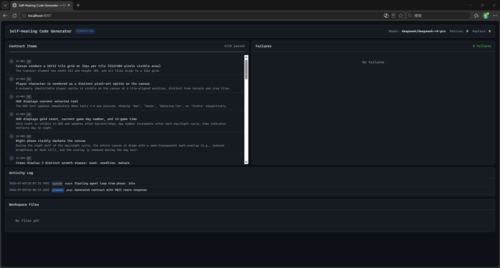

# Self-healing Code Generator

基于 [opencode SDK](https://opencode.ai) 2.x 的自我调试修复自动 Agent 系统。三角色协作（Planner / Generator / Evaluator），根据需求文档自主实现功能，遇到错误自动修复，直到达成目标或明确报告卡点。

## 架构设计

遵循 [doc/LOOP_PRINCIPLES.md](doc/LOOP_PRINCIPLES.md) 的循环哲学：

```
┌─────────────────────────────────────────────────┐
│  LOAD checkpoint → 确定从哪个阶段恢复              │
│                                                   │
│  ┌──────────┐   ┌───────────┐   ┌────────────┐  │
│  │ PLANNER  │──▶│ GENERATOR │──▶│ EVALUATOR  │  │
│  │ 分析需求  │   │ 写代码    │   │ 验证+评分   │  │
│  │ 产契约    │   │           │   │            │  │
│  └──────────┘   └───────────┘   └────────────┘  │
│       ▲               ▲               │         │
│       │               │         通过？  │         │
│       │  重新规划      │      ┌────┴────┐       │
│       ├───────────────┘      │YES │NO  │       │
│       │                      │    │    │       │
│       │                      ▼    ▼    │       │
│  ┌────┴────┐            成功报告  ┌───────────┐ │
│  │ 卡住？  │                      │ 修复循环   │ │
│  │ YES→USER│                      │ 错误回灌   │ │
│  │ NO→重试  │                      │  Generator │ │
│  └─────────┘                      └───────────┘ │
└─────────────────────────────────────────────────┘
```

### 三角色分离

| 角色 | System Prompt | 职责 | 约束 |
|------|--------------|------|------|
| **Planner** | 技术架构师 | 将模糊需求分解为可验证的契约条款 | 不动代码，只产出 contract |
| **Generator** | 代码执行者 | 按契约束编写实现 | **禁止评价自己的代码** |
| **Evaluator** | 验尸官 | 运行测试、检查边界条件 | 默认代码有 bug，证明它 |

三个角色是 `workspace/opencode.json` 里声明的三个 opencode agent，各自拥有独立的 session，
通过文件系统通信（`state/contract.json`、`state/evaluation.json`），不依赖上下文窗口记忆。

### 自愈合机制

1. Evaluator 返回失败 → 记录具体错误
2. 错误格式化后发给 Generator 修复（同一 session 续接）
3. 重新进入 Evaluator 验证
4. 同一错误重复 ≥maxRetries 次 → 触发 Planner 重新规划（新 session）
5. 重新规划后仍失败 ≥maxReplans 次 → 判定卡住，生成用户报告

补充一层结构性兜底：`maxTotalIterations` 硬上限。即使计数逻辑再出 bug，
循环也不会无限跑下去。默认 `(maxRetries+1)×(maxReplans+1)+2`。

### 失败分类

系统区分两类失败，**只有第一类消耗修复预算**：

| 类别 | 含义 | 计数 | 上限处理 |
|------|------|------|----------|
| 代码失败 | Evaluator 判定契约项未满足 | `retries` / `replanCount` | 重试 → 重新规划 → 判定卡住 |
| 基础设施失败 | provider 鉴权/限流/网络，或响应无法解析 | `infraErrors` / `parseErrors` | 原阶段退避重试，**不动修复预算**；连续超限才判定卡住 |

这样「API key 填错了」不会被伪装成「代码有 bug」，也不会白白烧掉重试与重规划次数。
两类失败都写入 `state/errors.jsonl`，诊断时先看它。

### 状态持久化

崩溃后重启可从断点继续运行。`checkpoint.json` 恢复阶段，`contract.json` 与
`evaluation.json` 一并载入，因此修复循环能从中断处继续，而不是从头重新生成。

| 文件 | 用途 |
|------|------|
| `state/checkpoint.json` | 当前阶段、session ID、重试/重规划/基础设施失败计数 |
| `state/contract.json` / `contract.md` | 契约（JSON 与可读清单） |
| `state/evaluation.json` | 最新评估结果 |
| `state/progress.md` | 当前进度摘要 |
| `state/log.md` | 追加式操作日志（`## [TIMESTAMP] ROLE \| action`） |
| `state/errors.jsonl` | 基础设施失败与解析失败（诊断入口） |
| `state/usage.json` | 请求数、token、花费累计 |
| `state/trace.md` | Agent 原始活动（`AGENT_TRACE=1` 开启） |
| `state/debug/` | JSON 解析失败的原始响应 |
| `state/requirements.bak.md` | 回复指令改写需求前的备份 |

## 快速开始

### 前置条件

- **Node.js ≥ 24**（SDK 2.x 依赖 `node:sqlite` 与 `await using`）
- **opencode CLI 2.x** 已安装
- 至少一个 provider 的凭据

### 安装

```bash
git clone <repo>
cd Self-healing_Code_Gen
npm install
npm run build
```

> 若 `npm install` 在 `tree-sitter-*` 上报 node-gyp 错误，说明 node 头文件不可用。
> 用 nvm 安装的 node 可通过 `npm_config_nodedir=$(dirname $(dirname $(which node)))` 解决。

### 配置 provider 凭据

推荐用 CLI 统一管理，凭据落在 opencode 的 SQLite 库里，本项目会自动读取，
不需要在项目里保存任何密钥：

```bash
opencode auth login
opencode auth list       # 确认显示 stored
```

也支持通过环境变量或项目配置提供（见下方「API Key 解析顺序」）。

### 编写需求

把需求写入 `requirements/current.md`。要求至少 20 个字符，
且**用单独一行 `---` 分段**，因为回复指令是按段落块操作的：

```markdown
一个经典扫雷游戏的复刻原型，使用 HTML/CSS/JS 在单页中运行。

输入：
- 鼠标左键点击：揭开方块
- 键盘 R 键：重新开始

输出：
- Canvas 渲染画面
- 胜利与失败画面
```

### 运行

```bash
npm start              # 交互模式，跑完等回复，Ctrl+C 退出
npm start -- --once    # 跑一轮，打印报告，按结果退出 0/1
npm run verify         # 端到端自检（会真实调用模型，花费几分钱）
```

### API Key 解析顺序

凭据也可以不经过 CLI，按以下顺序解析，命中即止：

| 顺序 | 来源 | 示例 |
|------|------|------|
| 1 | `--api-key` | `--api-key sk-xxx` |
| 2 | `--api-key-env` | `--api-key-env MY_KEY`，读指定环境变量 |
| 3 | `meta/config.ini` | `[model] api_key =` |
| 4 | 环境变量 | 由模型推导：`deepseek/x` → `DEEPSEEK_API_KEY` |
| 5 | key 文件 | `doc/DEEPSEEK_KEY.md`，可含代码围栏与注释行 |

环境变量名从模型的 provider 段推导，不是硬编码 `DEEPSEEK_API_KEY`。

### 命令行参数

| 参数 | 默认值 | 说明 |
|------|--------|------|
| `--requirements` | `requirements/current.md` | 需求文件路径 |
| `--workspace` | `workspace/` | 工作区目录（生成的代码与 `opencode.json`） |
| `--state-dir` | `state/` | 状态持久化目录 |
| `--output-dir` | `output/` | 报告输出目录 |
| `--model` | `deepseek/deepseek-flash` | 使用的模型 (`provider/model`) |
| `--api-key` | 无 | API Key |
| `--api-key-env` | 无 | 从指定环境变量读取 |
| `--key-file` | `doc/DEEPSEEK_KEY.md` | API Key 文件路径 |
| `--base-url` | 无 | 自定义 API 地址 |
| `--max-retries` | `4` | 触发重新规划前的最大修复尝试次数 |
| `--max-replans` | `2` | 判定"卡住"前的最大重新规划次数 |
| `--max-infra-errors` | `3` | 连续 provider 故障次数，超过即判定卡住（**不计入**修复预算） |
| `--max-total-iterations` | `(retries+1)×(replans+1)+2` | 循环总迭代硬上限 |
| `--serve-port` | `4097` | 仪表盘端口，**仅监听 127.0.0.1**；`0` 表示不启动 |
| `--once` | 关 | 跑完一轮就打印报告并退出，退出码 0/1 |
| `--help`, `-h` | | 显示帮助 |

未知参数或缺值会直接报错退出（退出码 1），不会被静默忽略。

`OPENCODE_DB_PATH` 可覆盖 opencode 数据库位置，默认 `~/.local/share/opencode/opencode.db`。
`AGENT_TRACE=1` 会把 Agent 原始活动写入 `state/trace.md`。

## 需求文件格式

用自然语言描述需求即可，要求 ≥ 20 字符。对照示例见 `doc/REQUIREMENTS_EXAMPLE.md`：

```
一个经典扫雷游戏的复刻原型，使用 HTML/CSS/JS 在单页中运行。

输入：
- 鼠标左键点击：揭开方块
- 键盘 R 键：重新开始

输出：
- Canvas 渲染画面
```

## 输出

### 成功时

- `workspace/` 包含实现的所有代码文件
- `state/` 包含完整的运行日志和契约
- `output/report.md` 包含成功摘要与花费统计

### 卡住时

报告包含：
- 已完成哪些
- 卡在哪个具体功能点
- 是代码问题还是 provider 问题（`blockingIssue` 会明确区分）
- 建议补充的信息

补充信息后重新运行即可从断点继续。

## Web 仪表盘

运行时默认在 `http://localhost:4097` 启动实时监控仪表盘，可在浏览器中观察 Agent 的每一步操作。可通过 `--serve-port` 自定义端口，`0` 关闭。

```bash
npm start                                  # 默认 http://localhost:4097
npm start -- --serve-port 3000             # 自定义端口
npm start -- --serve-port 0                # 不启动仪表盘
```

仪表盘每 2 秒自动刷新，展示：

| 区域 | 内容 |
|------|------|
| 状态栏 | 当前阶段徽章、重试/重新规划计数、模型信息、本次花费与 token |
| 契约面板 | 所有契约条目及通过/失败/待验证状态、进度条 |
| 失败详情 | Evaluator 发现的每一项失败，按严重程度着色（critical/high/medium/low） |
| 活动日志 | 追加式时间线，显示 Planner/Generator/Evaluator 每一步操作 |
| 工作区 | 生成的文件列表，点击可预览内容 |
| 回复表单 | 循环终止时自动显示，可输入修改指令提交 |

仪表盘**只监听 127.0.0.1**，且 `/api/workspace/*` 会做路径归一化与越界校验，
拒绝 `../` 形式的读取。它能读取工作区文件并接收改写需求的指令，因此不应暴露到局域网。



## 回复系统 (Reply System)

循环终止后（done 或 stuck），系统等待用户通过以下任一渠道提交修改指令，
自动更新需求并重启循环：

| 渠道 | 说明 |
|------|------|
| **CLI** | 直接在终端输入指令，按两次回车提交 |
| **Web** | 仪表盘页面显示回复表单，点击 Submit 提交 |

### 指令格式

支持三种操作，多个指令以 `---` 分隔：

```
修改需求: <匹配关键词>
新内容: <替换后的完整内容>
---
新增需求:
<追加的新需求>
---
删除需求: <匹配关键词>
```

**示例**：
```
修改需求: 输入验证
新内容: 输入必须是 1-100 的正整数，超出范围提示错误
---
新增需求:
增加深色模式切换按钮
---
删除需求: CSV导出
```

指令作用于**段落块**，而不是整篇文本。需求文件用单独一行 `---` 分段，
`删除需求` 会删除所有包含关键词的段落，其余内容不受影响。

三条安全规则，任一触发则整批指令都不写入、文件保持原样，并打印原因：

1. `删除需求` 的关键词必须命中至少一个段落
2. `修改需求` 必须给出 `新内容`，且关键词必须唯一命中一个段落
3. 改写后的需求不得为空、且不少于 20 字符

改写前会把原文件备份到 `state/requirements.bak.md`。

### 工作流程

```
Agent Loop 运行 → 循环终止（done/stuck）
                    ↓
              终端显示输入提示
              仪表盘显示回复表单
                    ↓
          CLI / Web 收到指令
                    ↓
          解析指令 → 校验 → 修改 requirements/current.md
                    ↓
               重置状态 → 重新运行 Agent Loop
```

## 项目结构

```
Self-healing_Code_Gen/
├── src/
│   ├── main.ts              # 入口文件 (CLI、编排、退出码)
│   ├── config.ts            # 配置加载 + API Key 五级解析
│   ├── loop.ts              # 核心循环控制器 (含 decideNextPhase)
│   ├── state.ts             # 状态持久化 / 用量统计
│   ├── opencode.ts          # SDK 2.x 封装 + 凭据水合 + provider 预检
│   ├── trace.ts             # Agent 原始活动落盘
│   ├── dashboard.ts         # Web 仪表盘 HTTP 服务 (仅 127.0.0.1)
│   ├── reporter.ts          # 报告生成
│   ├── reply.ts             # 回复指令解析 / 应用 / 等待
│   ├── requirements.ts      # 需求校验与段落块切分
│   ├── types.ts             # 类型定义
│   ├── json-parser.ts       # LLM JSON 解析 (多重修复策略)
│   ├── ini-parser.ts        # INI 配置解析器
│   ├── __tests__/           # 单元与集成测试
│   └── roles/
│       ├── planner.ts       # Planner 角色
│       ├── generator.ts     # Generator 角色
│       └── evaluator.ts     # Evaluator 角色
├── dashboard/
│   └── index.html           # 仪表盘前端页面
├── meta/
│   └── config.ini           # 用户配置文件 (模型、阈值)
├── doc/                     # 设计原则文档 & API 速查
│   ├── CODING_PRINCIPLES.md # 编码原则 (Karpathy)
│   ├── LOOP_PRINCIPLES.md   # 循环设计原则 (Karpathy)
│   ├── DEEPSEEK_KEY.md      # API Key (gitignore)
│   ├── REQUIREMENTS_EXAMPLE.md # 示例需求
│   └── SDK_COMPAT.md        # SDK 2.x 踩坑记录
├── state/                   # 运行时状态目录
├── requirements/            # 用户需求文件
├── workspace/               # Agent 在此目录构建项目
├── output/                  # 最终报告输出
└── verify.sh                # 端到端自检脚本
```

## 开发与验证

```bash
npm run typecheck   # tsc --noEmit
npm test            # 单元 + 集成测试 (node:test)
npm run check       # 两者都跑
./verify.sh         # 端到端：真实调用模型，断言状态文件产物
```

测试覆盖状态机跃迁的穷举、回复指令的块级编辑与事务性、LLM JSON 解析、
评估结果的交叉校验、API Key 解析，以及用桩客户端驱动的完整循环
（含「崩溃后从 fixing 恢复，不重新规划」和「坏 API key 不消耗重试预算」）。

`verify.sh` 会真实调用 provider（花费约 1 分钱），断言 `checkpoint.json` /
`usage.json` / `report.*` 都已生成、迭代预算被遵守、阶段是终态，且没有基础设施失败。

## 设计原则

系统严格遵循了两份原则文档：

- **LOOP_PRINCIPLES.md**: 写循环而非 prompt、三角色分离、先协商契约、写磁盘不写上下文、允许重启
- **CODING_PRINCIPLES.md**: 先读后写、最小差异、手术式修改、目标驱动、验证驱动

两份原则文档在 `doc/` 目录下，运行时由系统自动读取并注入到对应角色的 system prompt 中，
确保每个角色的 AI 都完整理解自己的职责和整套方法论的约束。

## License

MIT
